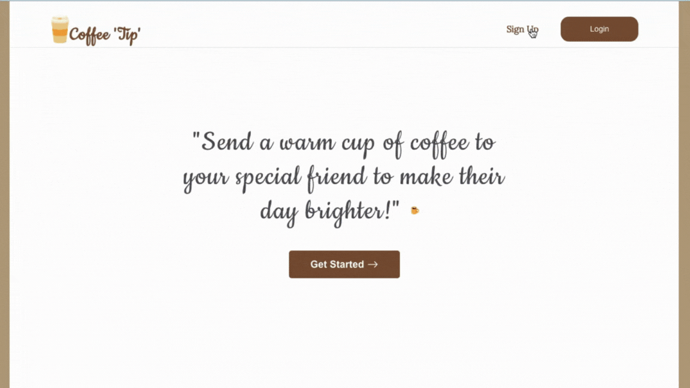

# Coffee Tip Website
A website that helps users collect tips using chimoney payment API

view the deployed project [here](https://coffeetip.vercel.app/)

## Getting Started with CoffeTip Project
Run the following commands in the project directory

- `npm install`
- `npm start`

Runs the app in the development mode.\
Open [http://localhost:3000](http://localhost:3000) to view it in your browser.

## ScreenRecord of the the website

